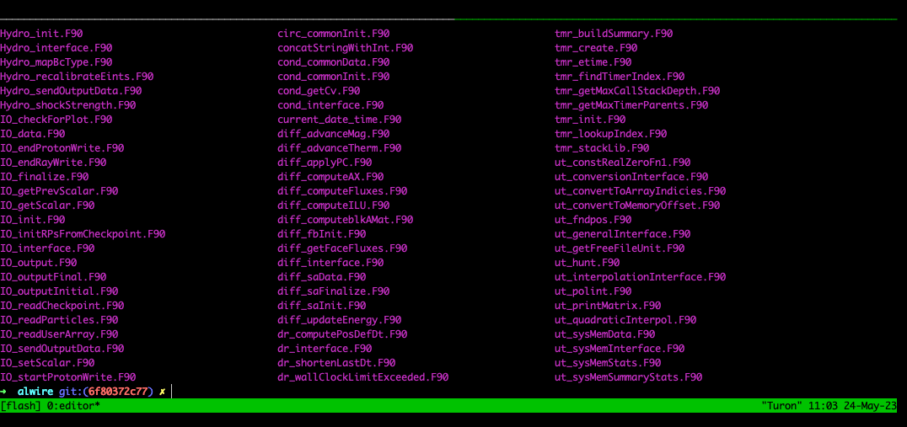
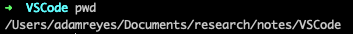
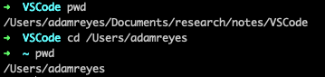
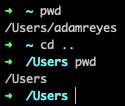
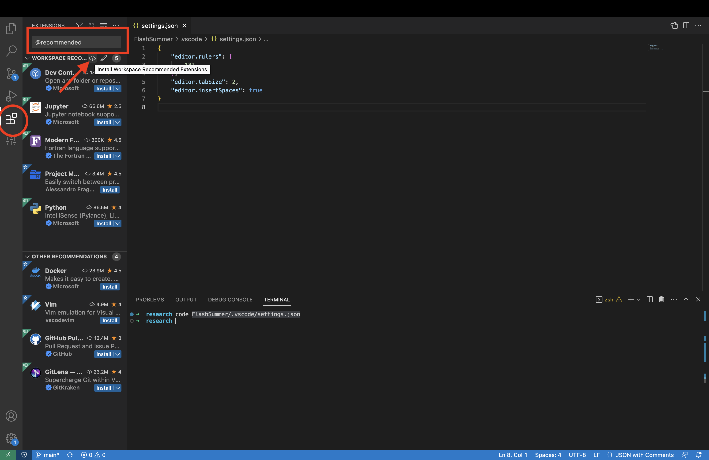
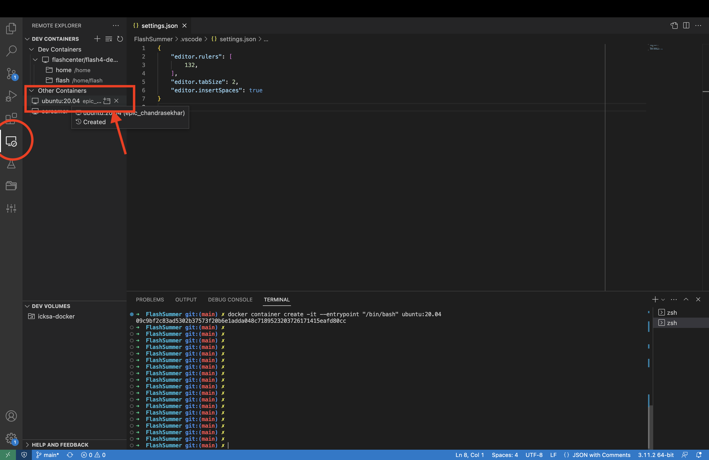

# From Zero to FLASH
## A Brief Introduction to Scientific Computing and the FLASH Code

### The Command Line

Common to all computing environments is the [shell](https://en.wikipedia.org/wiki/Shell_(computing)), which exposes the operating system's capabilities and services to a user. We might be most familiar with graphical-user interfaces (GUIs), which could be loosely characterized by:

* Interaction using graphical elements
* use both keyboard & mouse
* Structure & design changes over time
* More memory required for visual components
* Can be slower and less accurate


A command line shell on the other hand uses characters typed on a keyboard to enter commands and provide instructions interactively to the OS. 

* Only uses keyboard
* Less memory required, since only text is displayed through the terminal
* interface is universal across time and machines
* Interaction with the system is precise and quick



### Some Useful Commands

Let's open up a terminal and try out some commands (If you're using *Windows* you'll want to use the [WSL](https://learn.microsoft.com/en-us/windows/wsl/about)). 
This will not be an exhaustive list by any means, but please [check out other commands](https://users.soe.ucsc.edu/~dongwook/wp-content/uploads/2016/ams209/lectureNote/_build/html/chapters/chapt01/ch01_computing.html#scientific-computings-on-linux-unix-mac-os-x) as well as further options for the ones I'll show here to see what else can be done from the command line. 
The possibilities are almost limitless and I still learn new things all the time.

Now that you've fired up a terminal let's begin!

#### print working directory


```bash
pwd
```
This will print out where in the directory (current directory) structure you currently are

 


#### Changing directories

We can change our current working directory with the `cd` command, where we have to pass a directory as an argument to '`cd`' into.

```bash
cd /Users/adamreyes
```



We can also specify directories relative to our current working directory. "`.`" specifies the current directory and "`..`" our parent directory.



"`~`" is also used as a shorthand for your user's home directory. In my case this is `/Users/adamreyes`.

#### `ls`: listing a directory

```bash
ls
```

This will list all the files in the current directory. 
You can also pass a directory as an argument to the command that will list the files & directories at that directory level

```bash
ls /Users/adamreyes/Documents/research/notes/VSCode
```

You may also pass flags to commands, some examples for `ls` are `-a` to print all files including hidden ones, or `-l` for "long format".

```bash
ls -a
ls -l
```

### A more practical exercise

Now we'll showcase some more commands while setting up our computer for running FLASH. 
You'll need to install Docker & Visual Studio Code for yourself, but I've put everything else you need conveniently into a github repository.

We'll also do the rest of this using the terminal emulator in VSCode. This provides a convenient interface for using a terminal and editing
code inside of an editor all in one place.
From VSCode open a terminal window `Terminal -> New Terminal`

```bash
mkdir ~/research
cd ~/research
git clone https://github.com/acreyes/FlashSummer.git
```

We used the `mkdir` command to make a new directory in our home directory called `research` and changed our working directory to that location.
Next we used git to clone the files we need from a public repository hosted on github. 
We won't be using git this summer, so I won't go into much more detail about it.
For now it's just a magic black box that lets us share the same version of files.


#### Configuring VSCode

VSCode provides a CLI command `code` for interfacing with VSCode in various ways from the terminal. We want to add the newly checked out `FlashSummer` directory to our current VSCode workspace

```bash
code -a FlashSummer
```

The `-a` flag tells VSCode to add the argument to our current workspace. Now we'll want to save our new workspace `File -> Save Workspace As`.
You might notice that I've included a folder under `FlashSummer/.vscode` that contains some recommended settings and extensions for
using VSCode with FLASH. Let's take a look at one

```bash
code FlashSummer/.vscode/settings.json
```

This will open up the file in the VSCode editor window

```json
{
    "editor.rulers": [
        132,
    ],
    "editor.tabSize": 2,
    "editor.insertSpaces": true
}
```

#### Extensions

Now we want to install some helpful extensions. The file `FlashSummer/.vscode/extensions.json` provides some recommendations from me
that will make all of what comes next very helpful. Open up the extensions tab on the right and enter into the search bar `@recommended`,
which should then show a tab containing "Workspace Recommendations". Click the cloud icon to install all the recommended extensions.

{width=75%}


### Docker

Docker is a service that virtualizes an operating system inside of what are called containers. This allows for identical environments to be
virtualized across any machine that runs Docker. In our case it allows for the software dependencies of FLASH to be built in a way that is guaranteed to work and saves much of the headache that is involved in getting the code running on new machines. Often versions of
dependencies can conflict with what a user may have already installed, nuances of their environment can make it difficult to get everyting
configured the way FLASH expects.

Let's begin by making a completely blank Docker environment and see how we can install dependencies and compile and run code. We 
will be using the Ubuntu Linux OS, it may be already familiar to some of you and will be exactly the same as setting up a brand new
computer running Ubuntu. Start off by opening the Docker Desktop application so that Docker is running in the background. Now we create
the docker container:

```bash
docker container create -it -v $(pwd):/mnt/data --entrypoint "/bin/bash" ubuntu:20.04
```

This may take a minute to pull the ubuntu image from the web. What we've done is created a new container with an interactive 
terminal (`-it`), whose entrypoint is the bash shell. The `-v $(pwd):/mnt/data` creates a bind mount between our current directory on the host file system and the directory `/mnt/data` on the virtual OS.


Using the `Dev Container` VSCode extension we will be able to attach
to this virtualized OS and interact with it's shell using VSCode, both with it's terminal and as an editor. The container we just created
should be visible now in the `remote explorer` tab under `Dev Containers`.

{width=75%}

Attach to the container by clicking the "+" icon next to the dev container. This opens a new VSCode window, but now instead of seeing your
host computer's OS it should be inside the container's OS. Let's open up a terminal and get started!

We should see that the directory `/mnt/data` is bound to the `~/research` directory we made earlier. Check by listing what was there

```bash
ls /mnt/data
```

I've put some code in the `ubuntu` folder. Let's copy it into the container's file system and try it out.

```bash
cp /mnt/data/FlashSummer/ubuntu/* ./
```

Here we're using the `cp` command to copy the files in the first argument into the second. I've used the `*` wildcard to specify all the files and copy them into the current directory. Both files implement a vector dot product in Python & Fortran. Before we can run these we need to install the dependencies for the python interpreter & Fortran compiler.

```bash
apt-get update
apt-get install python3 gfortran
```

Now we can try running the code.

```bash
python3 VectorMatrix.py
```

Since Fortran is a compiled language we need to compile the code into an executable that we can run

```bash
gfortran VectorMatrix.F90
./a.out
```

Try to extend both codes to do the matrix multiplications.

## Running FLASH with Docker

Now we need to build a Docker container that installs all the various dependencies we need to run FLASH. The main ones are

* Fortran & C compilers
* Message Passing Interface (MPI) for multi-processor communication
* HDF5 for file I/O
* HYPRE library for linear solvers

We do this with a `Dockerfile` that gives a recipe for preparing a docker container with everything we need. `cd` into the `FlashSummer` directory we cloned from the git repo and you can look at what needs to be built. These commands are the same as you would have to do if you were building the libraries yourself on a computer rather than with Docker. The container can be built and created with:

```bash
make -j
docker container create -i -t -h icksa-docker --name flash4 -v $(pwd):/mnt/data flashcenter/flash4-deps-dev
```

We can attach to the container from VSCode just like we did before. Let's copy in the tarball of the code and uncompress it

```bash
cp /mnt/data/FlashSummer/FLASH4.7.1.tar.gz ./
tar -xvf FLASH4.7.1.tar.gz
cd FLASH4.7
```

Now we can setup a test problem in FLASH and run it.

```bash
./setup Sedov -auto -2d +uhd
cd object
```

We see that running setup creates an `object` directory and puts together symbolic links to all the source code files that we will
need to run the simulation that we have requested. We can compile and run now

```bash
make -j 4
mpirun -np 4 ./flash4
```

Here we use the `-j 4` and `-np 4` flags to run on 4 processors. We should now have checkpoint files in our object directory with the output
of our simulation. Let's copy our plotting notebook and try to visualize our simulation. 

```bash
cp /mnt/data/FlashSummer/plot_sedov.ipynb ./
code plot_sedov.ipynb
```

We're using [yt](https://yt-project.org) for visualization. I've only shown a simple colormap of density, but the library is capable of much more!


